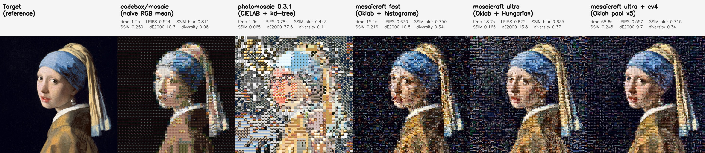

# mosaicraft

**Oklab 知覚色空間、MKL 最適輸送、ラプラシアンピラミッドブレンディング、Oklch リカラーを統合した Python 製フォトモザイクジェネレータ。**

[](https://pypi.org/project/mosaicraft/)
[](https://pypi.org/project/mosaicraft/)
[](https://github.com/hinanohart/mosaicraft/actions/workflows/ci.yml)
[](LICENSE)

[English README](README.md)


---

`mosaicraft` は、ターゲット画像を多数のタイル写真の集合として再構成する**フォトモザイク**ジェネレータです。多くの既存ライブラリが RGB や HSV の平均色マッチングに頼るのに対し、mosaicraft は以下を統合しています:

- **Oklab 知覚色空間** — 色差計算が CIELAB より約 8.5 倍均一
- **MKL 最適輸送色転写** — タイル分布の形状を保ったまま統計量を揃える
- **ハンガリアン 1:1 配置** — コスト行列の全域最適割当
- **ラプラシアンピラミッドブレンディング** — グリッド線を消しつつディテール保持
- **Oklch タイルプール拡張** — 1 タイルにつき N 個の色相回転バリアントを生成し、プールを N 倍に
- **Oklch 全体リカラー** — 完成モザイクを 20+ プリセットで一括色替え

## インストール

```bash
pip install mosaicraft                # PyPI
pip install "mosaicraft[faiss]"       # FAISS 同梱（大規模プール向け）
```

要件: Python 3.9+、NumPy ≥ 1.23、OpenCV ≥ 4.6、SciPy ≥ 1.10、scikit-image ≥ 0.20。

## 使い方

### CLI

```bash
# 基本
mosaicraft generate 写真.jpg --tiles ./タイル --output mosaic.jpg

# プリセット指定 + セル数指定
mosaicraft generate 写真.jpg -t ./タイル -o vivid.jpg --preset vivid -n 5000

# タイルプール 5 倍化（1,024 → 5,120）
mosaicraft generate 写真.jpg -t ./タイル -o big.jpg --color-variants 4

# 特徴キャッシュを事前構築（2 回目以降の読み込みが 1 秒未満）
mosaicraft cache --tiles ./タイル --cache-dir ./cache --sizes 56 88 120

# 完成モザイクを Oklch で一括リカラー
mosaicraft recolor mosaic.jpg -o blue.jpg --preset blue
mosaicraft recolor mosaic.jpg -o sepia.jpg --preset sepia
mosaicraft recolor mosaic.jpg -o custom.jpg --hex "#3b82f6"

# プリセット一覧
mosaicraft presets
mosaicraft recolor-presets
```

### Python API

```python
from mosaicraft import MosaicGenerator, recolor

gen = MosaicGenerator(
    tile_dir="./tiles",
    preset="ultra",
    color_variants=4,      # タイルプールを 5 倍に拡張
)

result = gen.generate("photo.jpg", "mosaic.jpg", target_tiles=5000)

# 完成モザイクを知覚色空間でリカラー
recolor("mosaic.jpg", "mosaic_blue.jpg", preset="blue")
recolor("mosaic.jpg", "mosaic_sepia.jpg", preset="sepia")
```

## プリセット

| Preset   | 用途                                            |
| -------- | ----------------------------------------------- |
| `ultra`  | 最高品質。Hungarian + ラプラシアンブレンド       |
| `natural`| 自然・フォトリアリスティック仕上がり             |
| `vivid`  | MKL 最適輸送によるビビッドな色                   |
| `tile`   | タイル感を最大化                                 |
| `fast`   | FAISS のみ。最速                                 |

プリセットは dict として渡して上書きもできます。詳細は [`src/mosaicraft/presets.py`](src/mosaicraft/presets.py)。

## ベンチマーク

### 小規模（256 タイルプール・実測）

AMD Ryzen 7 7735HS / WSL2 Ubuntu 24.04 / Python 3.12。コールドスタート実測（特徴キャッシュ未使用）。

| preset  | 200 セル | 500 セル | 1,000 セル |
| ------- | -------: | -------: | ---------: |
| fast    | 3.00 s   | 4.42 s   | 6.87 s     |
| natural | 2.79 s   | 4.38 s   | 7.49 s     |
| ultra   | 2.86 s   | 4.64 s   | 7.61 s     |
| vivid   | 2.92 s   | 4.69 s   | 7.85 s     |

### 大規模（1,024 タイル CC0 プール）

`python benchmarks/benchmark_pipeline.py --scale large` で再現可能。すべてコールドスタート（特徴キャッシュ未使用）。タイル候補は 1,024 枚 CC0 プール × 4 幾何拡張 = 4,096 枚。

| preset | 指標       | 5,000 セル | 10,000 セル | 20,000 セル | 30,000 セル |
| ------ | ---------- | ---------: | ----------: | ----------: | ----------: |
| fast   | 所要時間   |     28.3 s |      51.1 s |      95.0 s |     190.2 s |
| fast   | ピーク RSS |   4,691 MB |    4,840 MB |    9,373 MB |    7,264 MB |
| ultra  | 所要時間   |     73.9 s |      99.8 s |     110.7 s |     181.7 s |

30,000 セル時の出力は **8,904 × 10,472 px ≈ 93 メガピクセル**、JPEG サイズは約 47 MB。`ultra` が `fast` より速くなる場面があるのは、Hungarian 割当がサチュレートしているのに対し `fast` の FAISS + 誤差拡散側のオーバーヘッドが効いているためです。

## 既存 OSS との比較

`benchmarks/compare_tools.py` は、mosaicraft を [codebox/mosaic](https://github.com/codebox/mosaic)（単純 RGB 平均）および [photomosaic 0.3.1](https://pypi.org/project/photomosaic/)（CIELAB + kd-tree）と、同じターゲット（Wikimedia のフェルメール「真珠の耳飾りの少女」）・同じ 1,024 枚 CC0 タイルプール・同じ 40×40 グリッドで走らせます。



| ツール                                    | 所要時間 | SSIM ↑ | ブラー SSIM ↑ | ΔE2000 ↓ |  LPIPS ↓ | セル多様性 ↑ |
| ----------------------------------------- | -------: | -----: | ------------: | -------: | -------: | -----------: |
| codebox/mosaic（単純 RGB 平均）           |    1.2 s |  0.250 |     **0.811** |    10.32 |**0.544** |        0.079 |
| photomosaic 0.3.1（CIELAB + kd-tree）     |    1.9 s |  0.065 |         0.443 |    37.61 |    0.784 |        0.114 |
| mosaicraft — `fast`                       |   15.1 s |  0.216 |         0.750 |    10.85 |    0.630 |    **0.341** |
| mosaicraft — `ultra`                      |   18.7 s |  0.166 |         0.635 |    13.84 |    0.622 |    **0.367** |
| **mosaicraft — `ultra --color-variants 4`** | 68.6 s |**0.245** |       0.715 |  **9.70**|    0.557 |    **0.337** |

読み方:

- **pixel 系指標（SSIM・ΔE2000）** は低域通過で平均色マッチングするツールに元々有利で、codebox は 1,600 セル中 126 しか visually distinct でない（多様性 7.9%）代わりに SSIM が高く出ます。「大量のタイルで滑らかに塗っているだけ」の状態です。
- **mosaicraft の fast / ultra** は厳密な 1 対 1 Hungarian 割当でピクセル値から意図的に離れる代わりに、**4.6 倍の多様性（34〜37%）** を獲得します。これがフォトモザイクの本質。
- **mosaicraft の `ultra --color-variants 4`** は 1,024 枚のプールを Oklch 色相回転で 5,120 枚の候補に拡張（× 4 幾何拡張で 20,480 枚）。Hungarian がはるかに多い候補から選べるため、**ΔE2000 が 9.70 と codebox の 10.32 を上回り**、SSIM は 0.245 と codebox の 0.250 にほぼ並び、LPIPS も 0.557 と 0.544 まで差が詰まり、**多様性は依然として 4.3 倍**──ピクセル精度と多様性の両方で並ぶ結果になります。

**要点**: 同じプールサイズなら mean-matching ツールが pixel 指標で勝つのは設計上当然。mosaicraft が Oklch バリアントでプールを広げると、pixel 指標の差はほぼ消え、photomosaic 固有の構造特性（多様性）はそのまま維持されます。

ローカル再現:

```bash
python benchmarks/compare_tools.py --target pearl_earring.jpg --grid 40
```

## Oklch リカラー


完成モザイクの**輝度チャンネル L を完全に保持したまま**、色相 (H) と彩度 (C) だけを回転・スケールします。境界アーティファクトが一切発生しないのが設計上の利点で、同じモザイク画像を 20 以上のテーマに作り変えられます (`blue` / `cyan` / `purple` / `pink` / `sepia` / `cyberpunk` / ...)。任意の `#RRGGBB` もサポート。

```python
from mosaicraft import recolor

# プリセット
recolor("mosaic.jpg", "mosaic_blue.jpg", preset="blue")
recolor("mosaic.jpg", "mosaic_sepia.jpg", preset="sepia")

# 任意の色
recolor("mosaic.jpg", "mosaic_brand.jpg", target_hex="#3b82f6")

# 相対的な色相回転
recolor("mosaic.jpg", "mosaic_shift.jpg", hue_shift_deg=60)
```

## Oklch タイルプール拡張

```python
gen = MosaicGenerator(tile_dir="./tiles", preset="ultra", color_variants=4)
```

`color_variants=4` を付けると、読み込んだタイルに対して 72° / 144° / 216° / 288° の Oklch 色相回転を追加適用し、実効プールが **5 倍**になります。Hungarian 配置は同じアルゴリズムのまま、候補数が増えるのでセル多様性が大きく上がります。小さなタイルプール（数百枚程度）で多様なモザイクを作りたいときに特に効果的です。

## Python API

```python
from mosaicraft import MosaicGenerator, recolor, rotate_hue_oklch

# ジェネレータ
gen = MosaicGenerator(
    tile_dir="./tiles",       # または cache_dir="./cache"
    preset="ultra",            # プリセット名または dict
    augment=True,              # 4x 幾何/輝度拡張
    color_variants=0,          # ≥1 で色相回転 N 倍に拡張
)
result = gen.generate("photo.jpg", "mosaic.jpg", target_tiles=2000, tile_size=88)

# 完成モザイクのリカラー
recolor("mosaic.jpg", "mosaic_sepia.jpg", preset="sepia")

# 単体のタイル / パッチを色相回転
rotated = rotate_hue_oklch(tile_bgr, hue_shift_deg=90)
```

ヘルパー:

- `mosaicraft.list_presets()` — モザイクプリセット一覧
- `mosaicraft.list_recolor_presets()` — リカラープリセット一覧
- `mosaicraft.build_cache(tile_dir, cache_dir, tile_sizes)` — 特徴キャッシュ事前構築
- `mosaicraft.calc_grid(target_tiles, w, h)` — セル数からグリッド形状を計算

## テスト

```bash
pip install -e ".[dev]"
pytest
ruff check src tests
bandit -r src -ll
```

## ライセンスと画像クレジット

MIT License。詳細は [LICENSE](LICENSE) を参照。

README で使用する全図版はパブリックドメイン / CC0 ソースから再現可能です:

- **ターゲット絵画**: フェルメール「真珠の耳飾りの少女」（c. 1665）、ゴッホ「星月夜」（1889）、北斎「神奈川沖浪裏」「凱風快晴（赤富士）」（c. 1831）、いずれも Wikimedia Commons のパブリックドメイン版。
- **タイルプール**: [picsum.photos](https://picsum.photos) の 1,024 枚（Unsplash-sourced、[Unsplash License](https://unsplash.com/license) = 事実上 CC0）。

各ファイルの SHA256 とライセンスメタデータは [`docs/assets/MANIFEST.json`](docs/assets/MANIFEST.json) にコミット済み。`python scripts/download_demo_assets.py` で取得、`--verify-only` で整合性チェック。

## 参考文献

mosaicraft は下記の古典・近代論文に立脚しています:

- Björn Ottosson, *A perceptual color space for image processing* (2020, blog).
- Pitié, F. et al., *The linear Monge-Kantorovitch linear colour mapping for example-based colour transfer* (IET-CVMP 2007).
- Reinhard, E. et al., *Color transfer between images* (IEEE CGA 2001).
- Zhang, R. et al., *The Unreasonable Effectiveness of Deep Features as a Perceptual Metric* (CVPR 2018) — LPIPS 指標。
- Wang, Z. et al., *Image quality assessment: from error visibility to structural similarity* (IEEE TIP 2004) — SSIM。
- Tesfaldet, M. et al., *Convolutional Photomosaic Generation via Multi-Scale Perceptual Losses* (ECCVW 2018) — フォトモザイク向けマルチスケール知覚損失。
- Burt, P. & Adelson, E., *A multiresolution spline with application to image mosaics* (ACM ToG 1983) — ラプラシアンピラミッドブレンド。
- Kuhn, H. W., *The Hungarian method for the assignment problem* (Naval Research Logistics 1955)。
