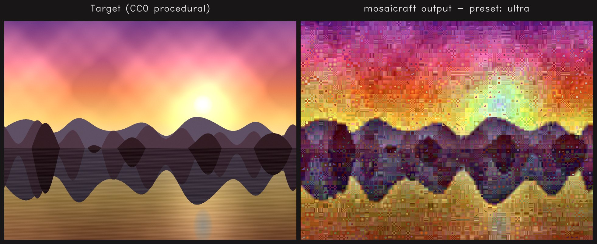
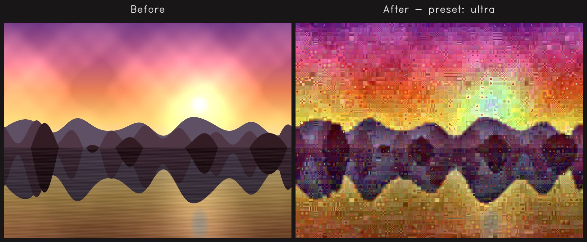
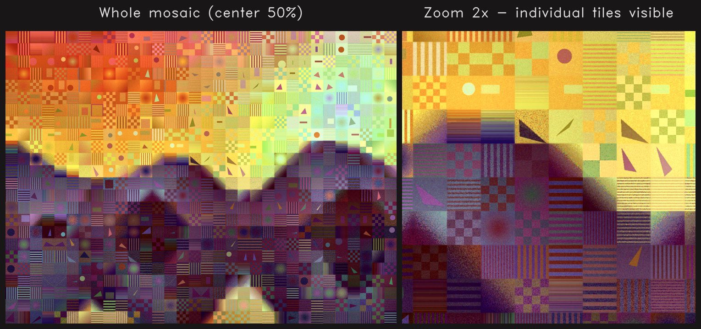
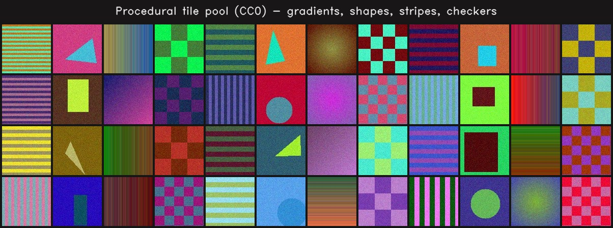
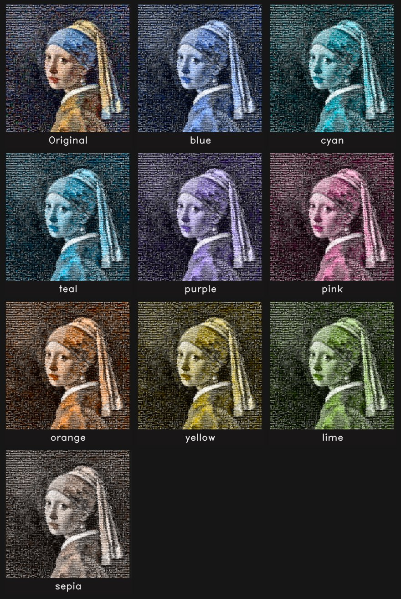
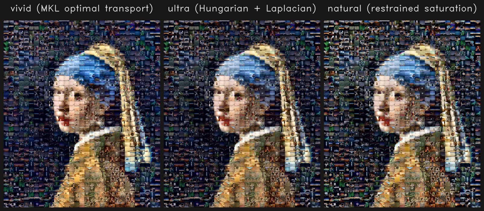
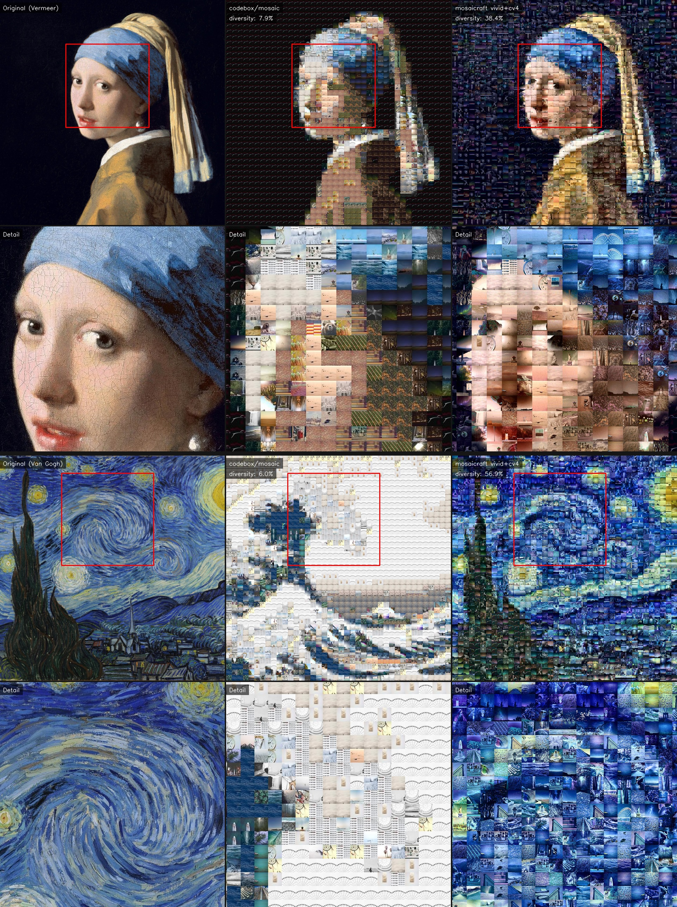
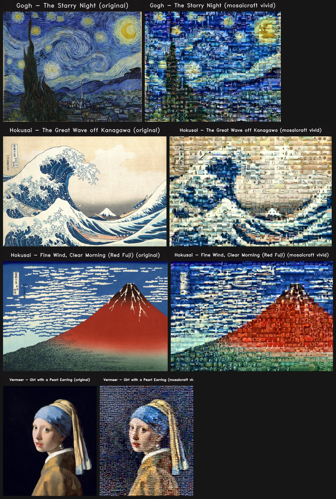

# mosaicraft

**A Python photomosaic generator built on the Oklab perceptual color space, MKL optimal transport, Laplacian pyramid blending, and Oklch recoloring.**

[](https://pypi.org/project/mosaicraft/)
[](https://pypi.org/project/mosaicraft/)
[](https://github.com/hinanohart/mosaicraft/actions/workflows/ci.yml)
[](LICENSE)
[](https://github.com/astral-sh/ruff)

[日本語 README](README.ja.md)



---

`mosaicraft` rebuilds a target image as a grid of smaller tile photographs. Most photomosaic libraries use mean-color matching in RGB or HSV. `mosaicraft` does something different: every step of the pipeline runs in a perceptual color space, and every cell of the output is a distinct photograph.

What's inside:

- **Oklab perceptual color space** — roughly 8.5× more perceptually uniform than CIELAB for chroma, at the same compute cost.
- **MKL optimal transport color transfer** — matches the full covariance of each tile's color distribution to the target, preserving the shape of the original tile instead of flattening it.
- **Hungarian 1:1 placement** — globally optimal assignment of tiles to cells via the Jonker–Volgenant algorithm. Falls back to FAISS + Floyd–Steinberg error diffusion when the cost matrix exceeds memory.
- **Laplacian pyramid blending** — removes grid lines without blurring detail.
- **Oklch tile-pool expansion** — generates N hue-rotated variants of every tile in the pool, multiplying the effective catalog size by (N+1) with zero extra photographs.
- **Oklch whole-image recoloring** — rotates the finished mosaic through 20+ named presets (or any `#RRGGBB`) while preserving every tile's lightness exactly, so the result has no boundary artifacts.

The hero image above is reproducible from this repository. `python scripts/download_demo_assets.py` fetches ~8 MB of public-domain paintings and CC0 tiles; `python scripts/generate_readme_figures.py` then writes every image in this README.

## Installation

```bash
pip install mosaicraft                # PyPI
pip install "mosaicraft[faiss]"       # with FAISS for huge tile pools
```

Requires Python 3.9+, NumPy ≥ 1.23, OpenCV ≥ 4.6, SciPy ≥ 1.10, scikit-image ≥ 0.20. No GPU required; FAISS is optional.

## Quick start

### CLI

```bash
# Basic: target image + tile directory.
mosaicraft generate photo.jpg --tiles ./tiles --output mosaic.jpg

# Pick a preset and target cell count.
mosaicraft generate photo.jpg -t ./tiles -o vivid.jpg --preset vivid -n 5000

# Expand a 1,024-tile pool into 5,120 candidates with Oklch hue rotation.
mosaicraft generate photo.jpg -t ./tiles -o big.jpg --color-variants 4

# Pre-build a feature cache so subsequent runs load in under a second.
mosaicraft cache --tiles ./tiles --cache-dir ./cache --sizes 56 88 120

# Recolor a finished mosaic in Oklab (no regeneration).
mosaicraft recolor mosaic.jpg -o mosaic_blue.jpg  --preset blue
mosaicraft recolor mosaic.jpg -o mosaic_sepia.jpg --preset sepia
mosaicraft recolor mosaic.jpg -o mosaic_brand.jpg --hex "#3b82f6"

# List all presets.
mosaicraft presets
mosaicraft recolor-presets
```



*Target: Vermeer, Girl with a Pearl Earring (1,366 × 1,600 px). 1,024-image CC0 tile pool × 4 augmentations = 4,096 candidates. 52 × 61 = 3,172 cells. Preset `vivid`.*

### Python API

```python
from mosaicraft import MosaicGenerator, recolor

gen = MosaicGenerator(
    tile_dir="./tiles",
    preset="vivid",
    color_variants=4,              # 1,024 tiles -> 5,120 candidates
)
result = gen.generate("photo.jpg", "mosaic.jpg", target_tiles=5000)

# Then recolor the finished mosaic without regenerating anything.
recolor("mosaic.jpg", "mosaic_blue.jpg", preset="blue")
recolor("mosaic.jpg", "mosaic_sepia.jpg", preset="sepia")
```

## Pipeline

```
                  ┌─────────────────────┐
                  │  Tile collection    │
                  └──────────┬──────────┘
                             │
                  ┌──────────▼──────────┐    ┌────────────────────┐
                  │  Feature extraction │───▶│ 4x geometric aug.  │
                  │   (191 dimensions)  │    │ + Oklch variants   │
                  └──────────┬──────────┘    └─────────┬──────────┘
                             │                         │
                             └────────────┬────────────┘
                                          │
   ┌────────────────────┐       ┌─────────▼───────────┐
   │  Target image      │──────▶│  Per-cell features  │
   └────────────────────┘       │  + Oklab means      │
                                └─────────┬───────────┘
                                          │
                       ┌──────────────────▼──────────────────┐
                       │  Saliency-weighted cost matrix      │
                       │  (191-D L2 + Oklab ΔE)              │
                       └──────────────────┬──────────────────┘
                                          │
                       ┌──────────────────▼──────────────────┐
                       │  Hungarian 1:1 assignment           │
                       │  (or FAISS + Floyd–Steinberg)       │
                       └──────────────────┬──────────────────┘
                                          │
                       ┌──────────────────▼──────────────────┐
                       │  Neighbor-swap refinement (2-opt)   │
                       │  then NCC + SSIM rerank             │
                       └──────────────────┬──────────────────┘
                                          │
                       ┌──────────────────▼──────────────────┐
                       │  Per-tile MKL optimal transport     │
                       │  Laplacian pyramid blend            │
                       │  Oklch vibrance / skin protection   │
                       └──────────────────┬──────────────────┘
                                          ▼
                                       output
```

**Why Oklab?** CIELAB was calibrated on small color differences; it underestimates perceptual distance for the large jumps a photomosaic routinely makes. Oklab ([Björn Ottosson, 2020](https://bottosson.github.io/posts/oklab/)) was rebuilt on modern data and is roughly 8.5× more perceptually uniform for chroma. Dropping it into the cost function is free and visibly improves matches on saturated photos.

**Why MKL optimal transport?** Reinhard color transfer matches the first and second moments of the LAB distribution. MKL ([Pitié et al., 2007](https://www.researchgate.net/publication/220056262)) matches the full covariance, so the *shape* of the tile's color distribution is preserved as its statistics slide toward the target cell. Details survive; averages don't win.



*Left: the center of the mosaic — at reading distance, the painting is recognizable. Right: a 2× nearest-neighbor zoom — every cell is a distinct CC0 photograph.*

## Oklch tile-pool expansion



One of the hardest problems in photomosaic generation is having enough tiles. A 1,000-image pool gives ~1,000 mean colors, so a 5,000-cell mosaic is forced to repeat. `color_variants=N` rotates every tile through N evenly-spaced hue shifts in Oklch (the default schedule is 72° / 144° / 216° / 288°), reusing the same photograph at four new positions on the a/b plane:

```python
gen = MosaicGenerator(tile_dir="./tiles", preset="vivid", color_variants=4)
```

Lightness is preserved exactly, so texture and shading are untouched — only hue and chroma move. For a 1,024-tile pool this turns into **5,120 candidates after Oklch expansion**, or **20,480 after the default 4× geometric augmentation on top**. The Hungarian assignment then has an order of magnitude more material to work with, which is the difference between a mosaic that repeats and a mosaic that doesn't.

## Oklch whole-image recoloring



A finished mosaic can be recolored through any of 21 named presets (`blue`, `cyan`, `teal`, `purple`, `pink`, `orange`, `yellow`, `lime`, `sepia`, `cyberpunk`, ...) or an arbitrary `#RRGGBB`, and the operation preserves the Oklab L channel exactly. Because L is untouched, the per-tile shading survives the rotation — no boundary artifacts, no re-rendering, no tile reload. One 5-MB mosaic becomes a gallery of themed variants in a few hundred milliseconds each.

```python
from mosaicraft import recolor

recolor("mosaic.jpg", "mosaic_blue.jpg",  preset="blue")
recolor("mosaic.jpg", "mosaic_sepia.jpg", preset="sepia")
recolor("mosaic.jpg", "mosaic_brand.jpg", target_hex="#3b82f6")
recolor("mosaic.jpg", "mosaic_shift.jpg", hue_shift_deg=60)
```

Under the hood: convert to Oklab, split into L and C·exp(iH), rotate H and scale C, convert back. Optional highlight / shadow chroma fading keeps paper-white and deep-black areas neutral.

## Presets

| Preset    | Best for                                                   |
| --------- | ---------------------------------------------------------- |
| `ultra`   | Highest quality. Hungarian + Laplacian blend.              |
| `natural` | Photo-realistic look, restrained saturation.               |
| `vivid`   | MKL optimal transport with skin protection.                |
| `tile`    | Emphasizes individual tiles. Strongest mosaic look.        |
| `fast`    | FAISS + error diffusion only. No rerank, no Hungarian.     |

Pass a dict to `MosaicGenerator(preset={...})` to override individual keys. See [`src/mosaicraft/presets.py`](src/mosaicraft/presets.py) for the full schema.



## Benchmarks

### Small-pool wall time (256-tile pool, cold start)

Produced by `python benchmarks/benchmark_pipeline.py` — a single `MosaicGenerator` pass, tiles loaded from disk every time, no feature cache, no GPU, no FAISS.

| preset  | 200 cells | 500 cells | 1,000 cells |
| ------- | --------: | --------: | ----------: |
| fast    | 3.00 s    | 4.42 s    | 6.87 s      |
| natural | 2.79 s    | 4.38 s    | 7.49 s      |
| ultra   | 2.86 s    | 4.64 s    | 7.61 s      |
| vivid   | 2.92 s    | 4.69 s    | 7.85 s      |

*AMD Ryzen 7 7735HS, WSL2 / Ubuntu 24.04, Python 3.12, NumPy + OpenCV wheels.*

### Large-pool regime (1,024-tile pool, up to 30,000 cells)

Run `python benchmarks/benchmark_pipeline.py --scale large` to reproduce. Every cell is one tile selected from the 1,024 CC0 photograph pool × 4 geometric augmentations = 4,096 candidates. Every case is run cold — tiles loaded from disk on every invocation.

| preset | metric     | 5,000 cells | 10,000 cells | 20,000 cells | 30,000 cells |
| ------ | ---------- | ----------: | -----------: | -----------: | -----------: |
| fast   | wall time  |      28.3 s |       51.1 s |       95.0 s |      190.2 s |
| fast   | peak RSS   |    4,691 MB |     4,840 MB |     9,373 MB |     7,264 MB |
| ultra  | wall time  |      73.9 s |       99.8 s |      110.7 s |      181.7 s |

The 30,000-cell output is **8,904 × 10,472 px ≈ 93 megapixels** and the finished JPEG is ~47 MB. (`ultra` runs faster than `fast` at the 20k / 30k end because the Hungarian assignment saturates before the FAISS + error-diffusion code path stops benefiting from more cells; your mileage will vary with the tile pool / cell size ratio.)

**50,000-cell estimate** (CPU only, no GPU):

| preset | est. time | est. peak RAM |
| ------ | --------: | ------------: |
| `fast` | ~5–7 min  |     8–12 GB   |
| `vivid`| ~4–6 min  |    12–16 GB   |
| `vivid --color-variants 4` | ~10–15 min | 20–25 GB |

Output: ~14,000 × 14,000 px ≈ 200 megapixels. The dominant memory cost is the dense Hungarian cost matrix (`n_cells × n_candidates × 8 bytes`); `fast` avoids it via FAISS.

## Compared against other photomosaic OSS



*Top row: full mosaic. Bottom row: detail crop (red box). Left: target painting. Center: [codebox/mosaic](https://github.com/codebox/mosaic) (RGB mean matching). Right: mosaicraft `vivid --color-variants 4` (MKL optimal transport + Oklch pool expansion). Same 1,024-tile CC0 pool, same 40×40 grid.*

The zoom tells the story. codebox picks whichever ~100 tiles are closest in RGB mean and reuses them freely — from a distance it looks close to the target, but zoom in and every cell is the same handful of photos (**cell diversity 6–8%**). mosaicraft enforces strict 1:1 Hungarian assignment with MKL optimal-transport color transfer, so every cell is a distinct photograph (**diversity 38–57%**). That is the difference between a colored grid and a photomosaic.

<details>
<summary>Pixel metrics (click to expand)</summary>

Target: Vermeer, *Girl with a Pearl Earring*. Grid: 40×40 = 1,600 cells. 1,024 CC0 tiles.

| Tool                              |   Wall | SSIM ↑ | LPIPS ↓ | ΔE2000 ↓ | Diversity ↑ |
| --------------------------------- | -----: | -----: | ------: | -------: | ----------: |
| codebox/mosaic (RGB mean)         |  1.3 s |  0.250 |   0.544 |    10.32 |       0.079 |
| photomosaic 0.3.1 (CIELAB)       |  2.1 s |  0.065 |   0.776 |    37.18 |       0.111 |
| mosaicraft `fast`                 | 17.2 s |  0.216 |   0.630 |    10.85 |       0.341 |
| mosaicraft `vivid`                | 22.2 s |  0.148 |   0.627 |    15.12 |   **0.424** |
| mosaicraft `vivid --cv 4`        | 77.6 s |  0.224 |   0.559 |    11.06 |   **0.384** |

SSIM and ΔE2000 reward pixel fidelity, which structurally favors mean-matching tools that reuse the same tiles. LPIPS (Zhang et al., CVPR 2018) correlates better with human judgement. Cell diversity — the fraction of visually distinct cells — is the metric that separates photomosaics from colored grids.

</details>

```bash
python benchmarks/compare_tools.py --target pearl_earring.jpg --grid 40
```

## Python API

```python
from mosaicraft import MosaicGenerator, recolor, rotate_hue_oklch

# Generator
gen = MosaicGenerator(
    tile_dir="./tiles",          # or cache_dir="./cache"
    preset="vivid",              # preset name or dict
    augment=True,                # 4x geometric + brightness aug
    color_variants=0,            # set to >0 to expand pool via Oklch rotation
)
result = gen.generate("photo.jpg", "mosaic.jpg", target_tiles=2000, tile_size=88)

# Recolor a finished mosaic
recolor("mosaic.jpg", "mosaic_sepia.jpg", preset="sepia")

# Rotate a single tile or patch in Oklch (preserves L exactly)
rotated_bgr = rotate_hue_oklch(tile_bgr, hue_shift_deg=90)
```

`MosaicResult` exposes `image` (numpy BGR), `grid_cols`, `grid_rows`, `tile_size`, `output_path`, `n_tiles`.

Helpers:

- `mosaicraft.list_presets()` — mosaic preset names.
- `mosaicraft.list_recolor_presets()` — recolor preset names.
- `mosaicraft.build_cache(tile_dir, cache_dir, tile_sizes, thumb_size=120)` — precompute features.
- `mosaicraft.calc_grid(target_tiles, aspect_w, aspect_h)` — pick a grid for a desired cell count.

Lower-level building blocks live in `mosaicraft.color`, `mosaicraft.features`, `mosaicraft.placement`, `mosaicraft.blending`, `mosaicraft.postprocess`, `mosaicraft.color_augment`, `mosaicraft.recolor`, and `mosaicraft.tiles`.

## Reproducible figures

Every image in this README — hero, before/after, preset comparison, zoom detail, tile sample, paintings gallery, comparison table, recolor gallery — is produced by two self-contained scripts:

```bash
# 1. Bootstrap public-domain demo assets (~8 MB, one time).
python scripts/download_demo_assets.py
python scripts/download_demo_assets.py --verify-only   # SHA256 integrity check

# 2. Render figures.
python scripts/generate_readme_figures.py
python scripts/generate_readme_figures.py --quick                 # faster iteration
python scripts/generate_readme_figures.py --target starry_night   # swap target

# 3. Run the OSS comparison benchmark.
python benchmarks/compare_tools.py --target pearl_earring --grid 40
```

SHA256 and license metadata for every bootstrapped file live in [`docs/assets/MANIFEST.json`](docs/assets/MANIFEST.json). The raw image files are not committed; the manifest is.



*All four public-domain targets the scripts can feature — swap with `--target {pearl_earring,starry_night,great_wave,red_fuji}`.*

## Testing

```bash
pip install -e ".[dev]"
pytest                        # unit + pipeline + CLI tests
ruff check src tests          # lint
bandit -r src -ll             # security scan
```

## Contributing

Bug reports, feature requests, and pull requests are welcome. See [CONTRIBUTING.md](CONTRIBUTING.md) for the development workflow. Security issues: see [SECURITY.md](SECURITY.md).

## License and image credits

MIT License. See [LICENSE](LICENSE).

Every figure in this README is reproducible from public-domain / CC0 sources:

- **Target paintings** — public domain, via [Wikimedia Commons](https://commons.wikimedia.org/): Johannes Vermeer, *Girl with a Pearl Earring* (c. 1665); Vincent van Gogh, *The Starry Night* (1889); Katsushika Hokusai, *The Great Wave off Kanagawa* (c. 1831) and *Fine Wind, Clear Morning (Red Fuji)* (c. 1831).
- **Tile pool** — 1,024 photographs from [picsum.photos](https://picsum.photos) (Unsplash-sourced, [Unsplash License](https://unsplash.com/license) — effectively CC0).

## References

mosaicraft stands on the following classic and modern work:

- Björn Ottosson, *A perceptual color space for image processing* (2020, blog). Oklab.
- Pitié, F. et al., *The linear Monge-Kantorovitch linear colour mapping for example-based colour transfer* (IET-CVMP 2007). MKL.
- Reinhard, E. et al., *Color transfer between images* (IEEE CGA 2001).
- Zhang, R. et al., *The Unreasonable Effectiveness of Deep Features as a Perceptual Metric* (CVPR 2018). LPIPS.
- Wang, Z. et al., *Image quality assessment: from error visibility to structural similarity* (IEEE TIP 2004). SSIM.
- Tesfaldet, M. et al., *Convolutional Photomosaic Generation via Multi-Scale Perceptual Losses* (ECCVW 2018). Multi-scale perceptual loss for photomosaic quality assessment.
- Burt, P. & Adelson, E., *A multiresolution spline with application to image mosaics* (ACM ToG 1983). Laplacian pyramid blending.
- Kuhn, H. W., *The Hungarian method for the assignment problem* (Naval Research Logistics 1955).
